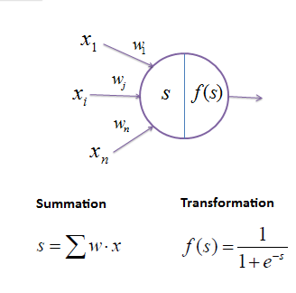

Machine learning and data mining Kernel Machine.svg Problems[show] Supervised learning (classification • regression) Clustering
Dimensionality reduction
Structured prediction
Anomaly detection
Neural nets
Reinforcement learning
Theory
Machine-learning venues
Glossary of artificial intelligence
Related articles
Portal-puzzle.svg Machine learning portal
vte
In machine learning, the perceptron is an algorithm for supervised learning of binary classifiers (functions that can decide whether an input, represented by a vector of numbers, belongs to some specific class or not).[1] It is a type of linear classifier, i.e. a classification algorithm that makes its predictions based on a linear predictor function combining a set of weights with the feature vector.

The code provided implements a single perceptron with 3 weights, 2 inputs. It evaluates output through a weighted sum. 
The illustration is provided below  

